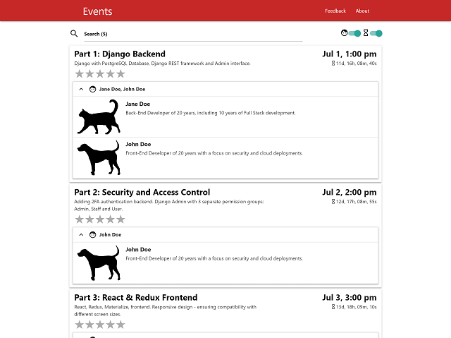

# Events

**[Live App: https://eventsr.herokuapp.com](https://eventsr.herokuapp.com)**

Built with React, Redux, Materialize, RESTful API and Django.

---

### Media Auto Complete Search

  

Makes a call to the Open Movie Database API for auto complete suggestions.

Features:

- Delay (time since user stops typing) before making API call can be set to reduce no. of API calls at the cost of responsiveness
- Preloader to indicate loading of media details after selection (useful feedback for users on slower networks)
- Caching to further reduce API calls (FIFO arbitrary limit of 1000, 10mins expiry)
- Intelligently decides if images should be shown in autocomplete dropdown based on latest network speed

---

### Mobile Demo

  
  

---

### Responsive Design

Text (event's title and date) and components adapt to different display resolutions.

  

---

### Ratings

Users can submit a rating for each event.

The overall rating from all users is only revealed once the users themselves have submitted a rating:

- Avoids priming user feedback with pre-existing ratings
- Encourages user participation by virtue of curiosity

  

  Ratings mouse-over, mouse-out & submit

---

### Countdown

  

---

### Performance Optimization

<a href="https://danieltjw.github.io/react-django-events/html/eventsr.herokuapp.com_2019-07-05_12-00-56.html" target="_blank" rel="noopener">Lighthouse Report</a>

  

- Asynchronous resources loading
- Images Optimization
- Static files caching
- Pre-rendering

---

### SMS Notification Service

An optional SMS notification service can send out a feedback summary after specified interval using Django's post_save signal.

This settings can changed on the fly through heroku's config variable dashboard without needing to redeploy the app.

---

### Security

Links opened in new window have the [`rel="noopener"` attribute](https://developers.google.com/web/tools/lighthouse/audits/noopener).

---

### Privacy

Person's private information such as phone numbers are not revealed by the API.

---

### Django Admin

  
  

---

### Testing with jest, enzyme, redux-mock-store

Testing redux actions & reducers, components snapshot testing

---

### Deployment in under 5 steps / mins

1. `npm test`
2. `npm run build` (creates 'build' directory and any postbuild steps such pre-rendering)
3. `git commit -a -m "hello world"` (commits the django directory, which includes react's 'build')
4. `git push heroku master` (heroku runs collectstatic and then deploys the django app which serves the react frontend)

App is now live!

---

(Updating...)
